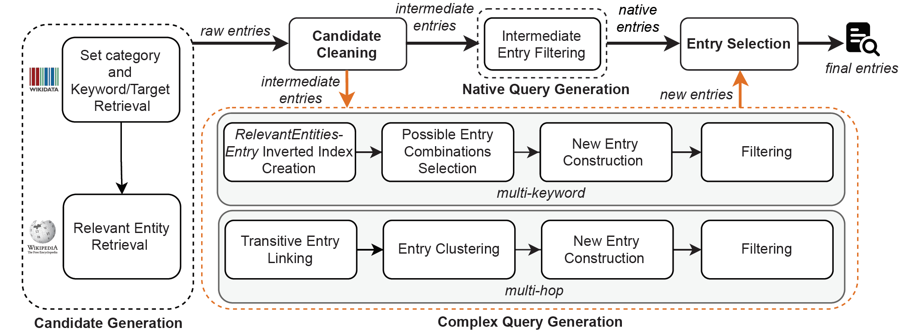
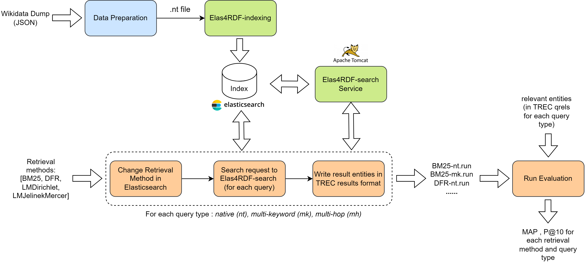

[](https://zenodo.org/badge/latestdoi/376782518)
[](https://github.com/fusion-jena/KeySearchWiki/blob/master/LICENSE)
# KeySearchWiki
## An Automatically Generated Dataset for Keyword Search over Wikidata

KeySearchWiki is a dataset for evaluating keyword search systems over [Wikidata](https://www.wikidata.org/wiki/Wikidata:Main_Page).
This dataset is particularly designed for the Type Search task (as defined by [J. Pound et al.](https://dl.acm.org/doi/pdf/10.1145/1772690.1772769) under Type Query), where the goal is to retrieve a list of entities having a specific type given by a user query (e.g., Paul Auster novels).

KeySearchWiki consists of 16,605 queries and their corresponding relevant Wikidata entities.
The dataset was automatically generated by leveraging Wikidata and Wikipedia set categories (e.g., [Category:American television directors](https://www.wikidata.org/wiki/Q8032156)) as data sources for both relevant entities and queries.
Relevant entities are gathered by carefully navigating the Wikipedia set categories hierarchy in all available languages.
Furthermore, those categories are refined and combined to derive more complex queries (e.g., multi-hop queries).

The dataset generation workflow is explained in detail in the paper and the steps needed to reproduce the current dataset or generate a new dataset version are described under [Dataset Generation](#dataset-generation).
Furthermore, a concrete use case of the dataset is demonstrated under [Experiments](#experiments) and the steps for evaluating the accuracy of relevant entities are presented under [Evaluation](#evaluation).

## Usage

The dataset can be used to evaluate Keyword Search Systems over Wikidata, specifically over the **Wikidata Dump Version of 2021-09-20**.
KeySearchWiki is intended for evaluating retrieval systems that answer a *user keyword query* by returning a *list of entities* given by their IRIs.

Both queries and relevant entities are provided following the format described in [Format](#format).
More insights about the **dataset characteristics** can be found [here](https://github.com/fusion-jena/KeySearchWiki/blob/master/docs#dataset-characteristics).
A concrete use case of the dataset is demonstrated in [Experiments](#experiments) using an approach based on a document-centric information retrieval system.

Potential users could either directly use the provided dataset version, or generate a new one that is in-line with their target knowledge graph.
The process of automatically generating a new dataset is described under [Dataset Generation](#dataset-generation).

### Format

The KeySearchWiki dataset is published on [Zenodo](https://doi.org/10.5281/zenodo.6010301) in two different formats: Standard [TREC format](https://trec.nist.gov/data/qrels_eng/) and JSON format.

<ins>*JSON Format*</ins>

`KeySearchWiki-JSON.json` gives a detailed version of the dataset. Each data entry consists of the following properties:

| Property | Description | Example |
| --- | --- | --- |
| `queryID` | Unique identifier of the query given by `prefix-number`, where prefix = [NT (native), MK (multi-keyword), or MH (multi-hop)] | `NT1149`, `MK79540`, `MH161`|
| `query` | Natural language query in this form: *<keyword1 keyword2 ... target>*| `male television actor human` |
| `keywords` | IRIs of Wikidata the entities (or literals) corresponding to the keywords, together with their labels, types and a boolean indicator `isiri`. If the keyword is literal `isiri = false`, if it is an IRI `isiri = true` | `{"iri":"Q10798782","label":"television actor","isiri":"true","types":[{"type":"Q28640","typeLabel":"profession"}]}]`|
| `target` | Type of entities to retrieve given by its Wikidata IRI and label | `{"iri":"Q5","label":"human"}` |
| `relevantEntities` | Entities that are relevant results to the query given by their Wikidata IRI and label | `{"iri":"Q16904614","label":"Zoological Garden of Monaco"}` as relevant result to the query `Europe zoo` |

<ins>*TREC Format*</ins>

- `KeySearchWiki-queries-label.txt`: A text file containing the queries. Each line containing space-seperated queryID and query: `MK79540 programmer University of Houston human`.
- `KeySearchWiki-queries-iri.txt`: A text file containing queries, each line contains space-seperated queryID and IRIs of query elements: `MK79540 Q5482740 Q1472358 Q5` (could be be directly used by systems that omit a preceding [Entity Linking](https://link.springer.com/content/pdf/10.1007%2F978-3-319-93935-3_5.pdf) step).
- `KeySearchWiki-queries-naturalized.txt`: A text file containing queries including 1826 adjusted queries, each line containing space-seperated queryID and query: `NT5239 diplomat Germany 20th century`. This is a list of queries that was partially
automatically adjusted (naturalized) to better reflect natural query formulation. For example, by transforming the query `NT5239 diplomat Germany 20th century human` into `NT5239 diplomat Germany 20th century`.
This is done by removing the target from the query if one of its keywords is a target descendant via subclass of (P279).
In the previous example, `diplomat` is in the subclass hierarchy of `human`.
- `KeySearchWiki-qrels-trec.txt`: A text file containing relevant entities in the [TREC format](https://trec.nist.gov/data/qrels_eng/): `MK79540 0 Q92877 1`.

### Examples

| queryID | query | keywords | target | relevantEntities
| --- | --- | --- | --- | --- |
| NT1149 | male television actor human | male(Q6581097), television actor(Q10798782) | human(Q5) | e.g., Q100028, Q100293|
| MK79540 | programmer University of Houston human | programmer(Q5482740), University of Houston(Q1472358)| human(Q5) | e.g., Q92877, Q6847972|
| MH161 | World Music Awards album | World Music Awards(Q375990) | album(Q482994) | e.g., Q4695167, Q1152760|

## Dataset Generation

The dataset generation workflow could be used either (1) to reproduce the current dataset version or (2) to generate a new dataset using other underlying Wikidata/Wikipedia versions.
We provide two options for dataset generation.

### From Dumps
1. First, two kind of dump versions should be selected:
  - [Wikidata JSON Dump](https://dumps.wikimedia.org/wikidatawiki/entities/) (`wikidata-<version>-all.json.gz`)
  - [Wikipedia SQL Dumps](https://dumps.wikimedia.org/backup-index.html) (available dataset versions could be checked by visiting e.g., [enwiki](https://dumps.wikimedia.org/enwiki/) for English Wikipedia)
2. Second, Setup a MariaDB database (place where Wikipedia SQL Dumps will be imported)
  - Install MariaDB : `sudo apt-get install mariadb-server`.
  - Set root password:
    ```
    $ sudo mysql -u root
    MariaDB [(none)]> SET PASSWORD = PASSWORD('DB_PASSWORD');
    MariaDB [(none)]> update mysql.user set plugin = 'mysql_native_password' where User='root';
    MariaDB [(none)]> FLUSH PRIVILEGES;
    ```
  - Create a Database:
    ```
    $ sudo mysql -u root
    MariaDB [(none)]> create database <DB_NAME> character set binary;
    Query OK, 1 row affected (0.00 sec)

    MariaDB [(none)]> use <DB_NAME>;
    Database changed
    ```
  - Optimize Database import by setting following parameter in `/etc/mysql/my.cnf` and then restart the database server `service mysql restart`.
  ```
  wait_timeout = 604800
  innodb_buffer_pool_size = 8G
  innodb_log_buffer_size = 1G
  innodb_log_file_size = 512M
  innodb_flush_log_at_trx_commit = 2
  innodb_doublewrite = 0
  innodb_write_io_threads = 16
  ```
3. Update [configuration file](https://github.com/fusion-jena/KeySearchWiki/blob/master/src/cache-population/config.js) in `./src/cache-population/config.js`
  ```
  // wikidata dump version
  wdDump: path.join(__dirname,'..', '..', '..', 'wikidata-<version>-all.json.gz'),

  // wikipedia dump version
  dumpDate : <wikipedia-version>,
  // wikipedia database user
  user: 'root',
  // wikipedia database password
  password: <DB_PASSWORD>,
  // wikipedia database name
  databaseName: <DB_NAME>,
  ```
4. Install [Node.js (minimum v14.16.1)](https://nodejs.org/en/)
5. First download the repository and install dependencies: run `npm install` in the project root folder.
6. Populate caches from dumps : `npm run runner`
7. Continue with the steps described under [Dataset Generation Workflow](#dataset-generation-workflow)

### From Endpoints
This option does not need local setup or prior cache population.
It allows to directly send requests to Wikidata/Wikipedia public endpoints:
  - [Wikidata public endpoint](https://query.wikidata.org/sparql)
  - [MediaWiki API](https://www.mediawiki.org/wiki/API:Main_page)

To generate a dataset from endpoints, the steps under [Dataset Generation Workflow](#dataset-generation-workflow) can directly be followed.

### Dataset generation workflow
The dataset generation workflow is illustrated in the following figure (see paper for more details).



*To reproduce the current KeySearchWiki version*, one can make use of the already filled caches.
The dataset is accompanied with cache files ([KeySearchWiki-cache.zip](https://doi.org/10.5281/zenodo.5752018)), a collection of SQLite database files containing all data retrieved from Wikidata JSON Dump and Wikipedia SQL Dumps of 2021-09-20.

To reproduce current dataset or generate a new one, the steps below should be followed (start directly with step 3 if Node.js and dependencies were already installed in [From Dumps](#from-dumps)):

1. Install [Node.js (minimum v14.16.1)](https://nodejs.org/en/)
2. First download the repository and install dependencies: run `npm install` in the project root folder.
3.  
  * *Generate from Endpoints* : setup `endpointEnabled: true` in `./src/config/config.js`.
  * *Generate from Dumps* : setup `endpointEnabled: false` in `./src/config/config.js`.
  * *Reproduce current dataset* : setup `endpointEnabled: false` in `./src/config/config.js`. In the root folder create a folder `./cache/`, unzip `KeySearchWiki-cache.zip` in  `cache` folder.
4. To generate the raw entries run `npm run generateCandidate` in the root folder. The output files can be found under `./dataset/` . In addition to log files (debugging), statistics files, the pipeline initial output is: `./dataset/raw-data.json`.
5. To generate the intermediate entries run `npm run cleanCandidate` in the root folder. Find the output entries under: `./dataset/intermediate-dataset.json`.
6. To generate the native entries run `npm run generateNativeEntry` in the root folder. Find the output entries under: `./dataset/native-dataset.json` (together with statistics (dataset characteristics) and metrics (Filtering criteria) files).
7. To generate the multi-hop new entries: first create the Keyword Index by running `npm run generateKeywordIndex`. After the process has finished, run `npm run generateNewEntryHop` to generate the entries. Find the output data under: `./dataset/new-dataset-multi-hop.json` (together with statistics/metrics files).
8. To generate the multi-keyword new entries run `npm run generateNewEntryKW`. Find the output under: `./dataset/new-dataset-multi-key.json` (together with statistics/metrics files).
9. To generate the final entries. First merge all the entries by running `npm run mergeEntries`. After the process has finished, run `npm run diversifyEntries` to perform the Entry Selection step. Find the output file under: `./dataset/final-dataset.json`. Generate statistics/metrics files by running `npm run generateStatFinal`.
10. Generate the files in final formats described in [Format](#format) by running `npm run generateFinalFormat`. All KeySearchWiki dataset files are also found under `./dataset`.
11. Naturalized queries are generated by running `npm run naturalizeQueries`. The output file `KeySearchWiki-queries-naturalized.txt` is found under `./dataset`.

Note that some steps will take a long time. Consider waiting till each process has finished.

The parameters used to perform Filtering (see Workflow) could be set in the following config files depending on query type:

* [Multi-hop queries config](https://github.com/fusion-jena/KeySearchWiki/blob/master/src/complex-queries-generation/multi-hop/config.js)
* [Multi-keyword queries config](https://github.com/fusion-jena/KeySearchWiki/blob/master/src/complex-queries-generation/multi-keyword/config.js)
* [Native-queries config](https://github.com/fusion-jena/KeySearchWiki/blob/master/src/post-processing/config.js)

#### Remark

:red_circle: *Note that since the 06th March 2022, the Wikidata "Wikimedia set categories (Q59542487)" were merged with their initially superclasses "Wikimedia categories (Q4167836)"*.
*This was done by redirecting the "Wikimedia set categories (Q59542487)" to the latter entity.*\
*While the generation of the current dataset version is reproducible, generating new datasets based on "Wikimedia set categories (Q59542487)" will be only possible on Wikidata Dump/Endpoints based on versions released before 2022-03-06, where the differentiation between the two types was still existing.*
*Theoretically, to generate a new dataset using the general "Wikimedia categories (Q4167836)" from any Dump/Endpoint version, one should only adjust the entity IRI in the corresponding project global config file ([categoryIRI](https://github.com/fusion-jena/KeySearchWiki/blob/master/src/config/config.js#L10)).*\
*However, executing the entire pipeline on the public endpoint will likely result in timeouts due to the larger number of categories compared to the previously used set categories.*
*A custom server/endpoint can be configured with larger timeout thresholds to account for this issue. Using the dumps does not suffer from this issue. We also plan to publish a new dataset version based on the more general Wikimedia categories.*

## Experiments
We demonstrate the usability of KeySearchWiki dataset for the task of keyword search over Wikidata by applying it on different traditional retrieval methods using the approach proposed by [G. Kadilierakis et al.](https://link.springer.com/chapter/10.1007%2F978-3-030-49461-2_8).
This method proposes a configuration of [Elasticsearch](https://www.elastic.co/guide/en/elasticsearch/reference/current/index.html) search engine for RDF.

In particular, two services are provided:
  * [Elas4RDF-index Service](https://github.com/SemanticAccessAndRetrieval/Elas4RDF-index): creates an index of an RDF dataset based on a given configuration.
  * [Elas4RDF-search Service](https://github.com/SemanticAccessAndRetrieval/Elas4RDF-search): performs keyword search over the indexed data and returns a list of results (triples, entities).

### Experimental setup
The following figure depicts the experiments pipeline for evaluating some retrieval methods over KeySearchWiki using both Elas4RDF-index and Elas4RDF-search services:




### Data preparation
This step consists of preparing the data in the N-Triples format accepted by the Elas4RDF-index service.
The first step is extracting a subset of triples from Wikidata JSON Dump.
To avoid indexing triples involving all Wikidata entities and keep indexing time reasonable, experiments are performed on a subset of KeySearchWiki queries (having one of [top-10 targets](https://github.com/fusion-jena/KeySearchWiki/blob/master/src/experiments/config.js#L14)).
Therefore, we index triples involving Wikidata entities that are either instance of the target itself or any of its subclasses.
This way we keep 99% (only 112 queries discarded) of the queries from all the types (native: 1,037, multi-keyword: 15,343, multi-hop: 113).
For each Wikidata entity of interest we store the following information (needed by [indexing step](#indexing)):
```
{
  id:"Q23",
  description:"1st president of the United States (1732−1799)",
  label:"George Washington",
  claims:{
    "P25":[{"value":"Q458119","type":"wikibase-item"}]
    "P509":[{"value":"Q1347065","type":"wikibase-item"},{"value":"Q3827083","type":"wikibase-item"}],
    ...
  }
}
```

In the second step, we get the description and label for all the objects (``wikibase-item``) related to the selected entities (e.g., ``Q1347065``).
Finally, N-Triples are generated from entities and their objects description/label:
```
  <http://www.wikidata.org/entity/Q23> <http://www.w3.org/2000/01/rdf-schema#label> "George Washington"@en .
  <http://www.wikidata.org/entity/Q23> <http://schema.org/description> "1st president of the United States (1732−1799)"@en .
  <http://www.wikidata.org/entity/Q23> <http://www.wikidata.org/prop/direct/P25> <http://www.wikidata.org/entity/Q458119> .
  <http://www.wikidata.org/entity/Q23> <http://www.wikidata.org/prop/direct/P509> <http://www.wikidata.org/entity/Q1347065> .
  <http://www.wikidata.org/entity/Q23> <http://www.wikidata.org/prop/direct/P509> <http://www.wikidata.org/entity/Q3827083> .
  ...
```
Data preparation for our experiments is reproduced by running the command `npm run prepareData` in the project's root folder.

### Indexing
We used the same best performing indexing (extended (s)(p)(o)<sup>2</sup>) reported by [G. Kadilierakis et al.](https://link.springer.com/chapter/10.1007%2F978-3-030-49461-2_8), where each triple is represented with an Elasticsearch document consisting of the following fields:
- Keywords of subject/predicate/object: Represent the literal value. If triple component is not a literal, the IRI’s namespace part is removed and the rest is tokenized into keywords.
- Descriptions of subject/object.
- Labels of subject/object.

Example document indexed in Elasticsearch corresponding to the triple `<http://www.wikidata.org/entity/Q23> <http://www.wikidata.org/prop/direct/P25> <http://www.wikidata.org/entity/Q458119>`:
```
{
  "subjectKeywords": "Q23",
  "predicateKeywords": "P25",
  "objectKeywords": "Q458119",
  "rdfs_comment_sub": ["1st president of the United States (1732−1799) @en"],
  "rdf_label_sub": ["George Washington @en"],
  "rdfs_comment_obj": ["mother of George Washington @en"],
  "rdf_label_obj": ["Mary Ball Washington @en"]
}
```
First, Elas4RDF-index service is adapted to Wikidata by manually replacing the namespace in `Elas4RDF-index/index/extended.py` on [line 212](https://github.com/SemanticAccessAndRetrieval/Elas4RDF-index/blob/master/index/extended.py#L212) by: `http://www.wikidata.org/entity`.

Then indexing is started by following the instructions in [Elas4RDF-index](https://github.com/SemanticAccessAndRetrieval/Elas4RDF-index)

Make sure that:
- The Elasticsearch server is started.
- The generated N-Triples file is put within the place specified in the ``/Elas4RDF-index/res/configuration/.properties`` configuration file under the property `index.data`.
Our used configuration file can be found here [`./data/Elas4RDF-config/wiki-subset.properties`](https://github.com/fusion-jena/KeySearchWiki/blob/master/data/Elas4RDF-config/wiki-subset.properties).

Indexing was started using this command: `python3 indexer_service.py -config ./Elas4RDF-index/res/configuration/wiki-subset.properties` in Elas4RDF-index root folder.

### Search Service Setup

First, Elas4RDF-search service is adapted to Wikidata by manually adding the namespace `http://www.wikidata.org/entity` in `Elas4RDF-search/src/main/java/gr/forth/ics/isl/elas4rdfrest/Controller.java` on [line 43](https://github.com/SemanticAccessAndRetrieval/Elas4RDF-search/blob/master/src/main/java/gr/forth/ics/isl/elas4rdfrest/Controller.java#L43).

Then, the search service is setup by following the instructions in [Elas4RDF-search](https://github.com/SemanticAccessAndRetrieval/Elas4RDF-search).

The index initialization for search was performed using the following command: `curl --header "Content-Type: application/json" -X POST localhost:8080/elas4rdf-rest-0.0.1-SNAPSHOT/datasets -d "@/Elas4RDF-index/output.json"`.

The file `output.json` is automatically generated after the indexing process.
The created output file in our case can be found here [`./data/Elas4RDF-config/output.json`](https://github.com/fusion-jena/KeySearchWiki/blob/master/data/Elas4RDF-config/output.json).

### Evaluation

The evaluation pipeline (orange) takes a list of retrieval methods (provided by Elasticsearch), communicates with the Elasticsearch index and the Elas4RDF-search service to generate search results (runs), and finally calculates evaluation metrics for each run.

For the evaluation, the TREC format for KeySearchWiki is used.
We start by grouping the queries (`KeySearchWiki-queries-label.txt`) and relevant results (`KeySearchWiki-qrels-trec.txt`) files by query type to allow for comparison.
This results in 3 files for both queries and relevance judgements (qrels) for each query type (native, multi-keyword, multi-hop).
Used queries and qrels files can be found respectively under: `KeySearchWiki-experiments/queries` and `KeySearchWiki-experiments/qrels` in [KeySearchWiki-experiments](https://doi.org/10.5281/zenodo.6010349).

The first step is to send a request to the Elasticsearch index to change the retrieval method.
Then, for each query type and for each query, a search request is sent to the Elas4RDF-search service.
A list of ranked relevant entities (refer to Section 4.5 in [G. Kadilierakis et al.](https://link.springer.com/chapter/10.1007%2F978-3-030-49461-2_8)) is returned and the results are written in the TREC results format: `<queryID> Q0 <RetrievedEntityIRI> <rank> <score> <runID>`.
The resulted runs are under: `KeySearchWiki-experiments/runs` in [KeySearchWiki-experiments](https://doi.org/10.5281/zenodo.6010349).

After all runs are generated, each run and its corresponding qrels file are given as input to the standard [trec_eval](https://github.com/usnistgov/trec_eval/releases/tag/v9.0.7) tool to calculate the Mean Average Precision (MAP) and the Precision at rank 10 (P@10).
To run the evaluation pipeline follow the steps below:
1. Download the [trec_eval v9.0.7](https://github.com/usnistgov/trec_eval/releases/download/v9.0.7/trec_eval-9.0.7.tar.gz).
2. Unzip the tool in `./src/experiments/trec-tool/trec_eval-9.0.7` (after folders creation), and compile it by typing `make` in the command line.
3. Run the evaluation using `npm run runEval` (output under `./experiments`).
Evaluation results are found under: `KeySearchWiki-experiments/results` in [KeySearchWiki-experiments](https://doi.org/10.5281/zenodo.6010349).

### Results
The following table summarizes the experiment results of the different retrieval methods. We use MAP and P@10 as evaluation metrics (considering the top-1000 results):

<table>
  <thead>
  <tr>
    <th>Method</th>
    <th colspan="2">Native</th>
    <th colspan="2">Multi-Keyword</th>
    <th colspan="2">Multi-hop</th>
  </tr>
  <tr >
    <td></td>
    <td markdown="span"><b>MAP</b></td><td ><b>P@10</b></td>
    <td ><b>MAP</b></td><td ><b>P@10</b></td>
    <td ><b>MAP</b></td><td ><b>P@10</b></td>
   </tr>
  </thead>
  <tbody>
  <tr>
	<td ><b>BM25</b></td>
	<td >0.211</td><td ><b>0.225</b></td>
	<td ><b>0.025</b></td><td ><b>0.039</b></td>
	<td >0.014</td><td ><b>0.032</b></td>
  </tr>
  <tr>
  <td ><b>DFR</b></td>
  <td >0.209</td><td >0.211</td>
  <td >0.023</td><td >0.029</td>
  <td >0.015</td><td >0.024</td>
  </tr>
  <tr>
  <td ><b>LM Dirichlet</b></td>
  <td >0.182</td><td >0.180</td>
  <td >0.020</td><td >0.025</td>
  <td >0.015</td><td >0.018</td>
  </tr>
  <tr>
  <td ><b>LM Jelinek-Mercer</b></td>
  <td ><b>0.212</b></td><td >0.215</td>
  <td >0.023</td><td >0.029</td>
  <td ><b>0.018</b></td><td >0.022</td>
  </tr>
  </tbody>
</table>

## Evaluation

We evaluate the accuracy of relevant entities in KeySearchWiki by comparing with existing SPARQL queries.
For this purpose we calculate the Precision and Recall of KeySearchWiki entities with respect to SPARQL query results.
To run the evaluation scripts the steps below should be followed:

1. run `npm run compareSPARQL` in the root folder. The output files can be found under `./eval/`.
2. run `npm run generatePlots` in the root folder to generate metrics plots. The output can be found under `./charts/`.

Note that the `compareSPARQL` script uses the `./dataset/native-dataset.json` as input.
For that steps 1-6 from [Dataset generation workflow](#dataset-generation-workflow) should be executed first.

Current evaluation results could be found under [`./data/eval-results`](https://github.com/fusion-jena/KeySearchWiki/blob/master/data/eval-results/).

Detailed analysis of the results can be found [here](https://github.com/fusion-jena/KeySearchWiki/blob/master/docs#evaluation-results).

<!---## Cite , consider updating codemeta with paper link and also zenodo metadata-->

## License
This project is licensed under the [MIT License](https://fusion.cs.uni-jena.de/git/xi75yod/kwsearch-goldstandard-generation-wikidata/-/blob/master/LICENSE).
