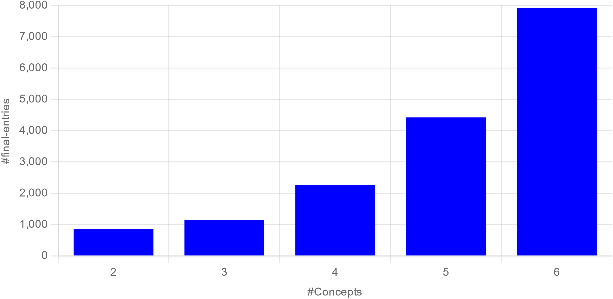
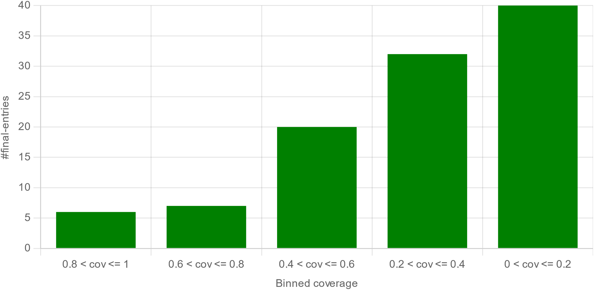
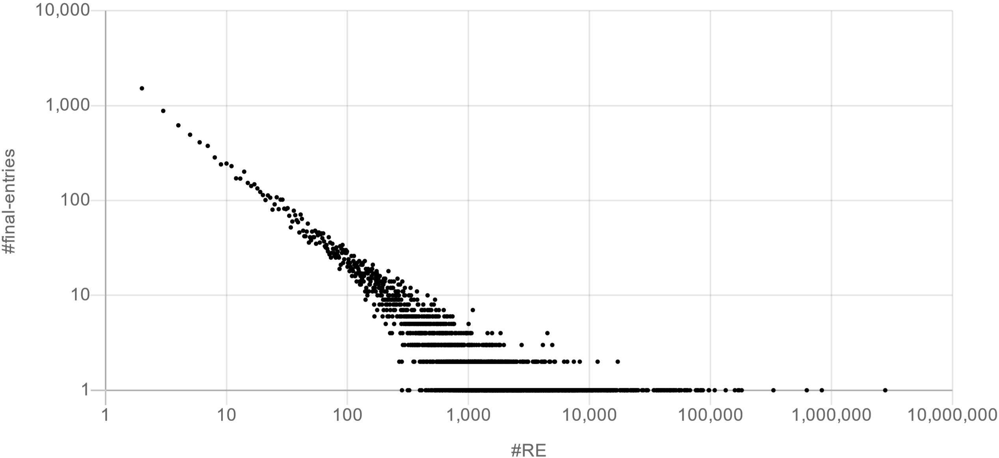
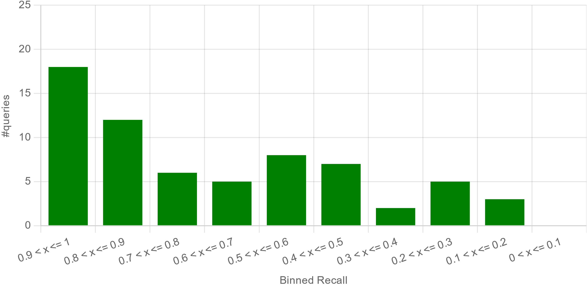
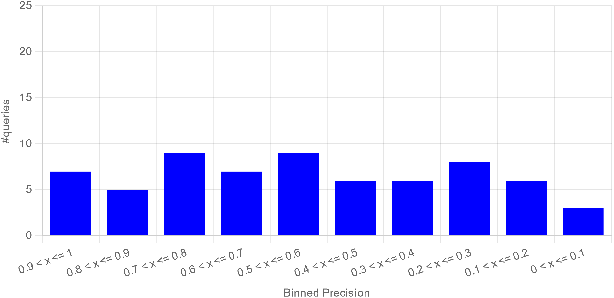

# DATASET CHARACTERISTICS

The current dataset version is generated using Wikidata JSON dump and Wikipedia SQL dumps of 2021-09-20.

The following figure shows the number of entries depending on the number of query keywords/target (#Concepts) in each entry.
The #Concepts varies between 2 and 6 with more queries of higher #Concepts since the dataset complexity was increased by generating more multi-keyword queries.
The average #Concepts is 5.04

We also analyze the coverage of multi-hop entries as shown in the figure below.
There are 33 entries with a good coverage (*0.6 ≤ cov ≤ 1*), while the remaining 80 entries have a moderate/low coverage.
This indicates that particular types of set categories (e.g., albums of an artist) are only available for a subset of possible combinations
(i.e., some artists). This is mainly caused by lacking category pages in Wikipedia.

The following figure illustrates the distribution of the relevant entities (#RE) over the final entries. Both axes using a log scale.
We notice a power-law distribution, where 89% (14,760) of the final entries have a #RE less than or equal to 1,000
and only 11% (1,845) of the entries have a #RE larger than this.

# EVALUATION RESULTS

For selected KeySearchWiki queries, we calculate the *Precision* and *Recall* of KeySearchWiki entities with respect to corresponding SPARQL query results.
Results reveal that KeySearchWiki is capable of catching most of the relevant entities retrieved by SPARQL resulting in an *Average Recall* of ~ 0.70 and an *Average Precision* of ~ 0.54.
Details are illustrated in the following figures that show the distribution of both metrics for the considered 66 queries.

Based on the figure below we observe that for 56 out of 66 queries, at least 50% of relevant entities retrieved using SPARQL also appear in KeySearchWiki entities, 30 queries share even more than 80% of the entities, and none of the queries has a *Recall ≤ 0.1* .

The next figure shows an uniform distribution of the *Precision*.
For 43 out of 66 queries, at least half of the entities that appear in KeySearchWiki are also retrieved using SPARQL and 7 queries share more than 80% of the entities.

In general, the results demonstrate a high *Recall* overall.
The main reason for queries with lower *Recall* comes down to the fact that some results found by the SPARQL-queries cannot be found in the corresponding Wikipedia category page nor its hierarchy.
Since the overall *Precision* provides a rather mixed picture, we conducted a more detailed investigation into possible reasons (items that were found in Wikipedia but not by SPARQL) that are shortly listed in the following:
- **Different property value**: The SPARQL query may use a property value different from the one present on a KeySearchWiki relevant entity.
- **Missing property**: Some entities retrieved from Wikipedia are not sufficiently annotated
- **Usage of another property**: Some entities contain the correct value, but use a different property than the one used in the SPARQL query.

For more details about the different reasons refer to [L. Feddoul, F. Löffler, S. Schindler, Analysis of consistency between wikidata and wikipedia
categories, in: Proceedings of the 3rd Wikidata Workshop 2022 co-located with the 21st
International Semantic Web Conference (ISWC2022)](https://ceur-ws.org/Vol-3262/paper4.pdf)

